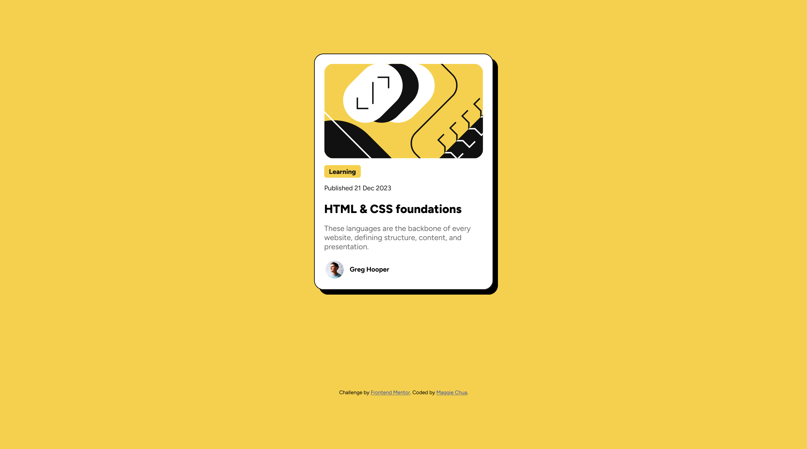
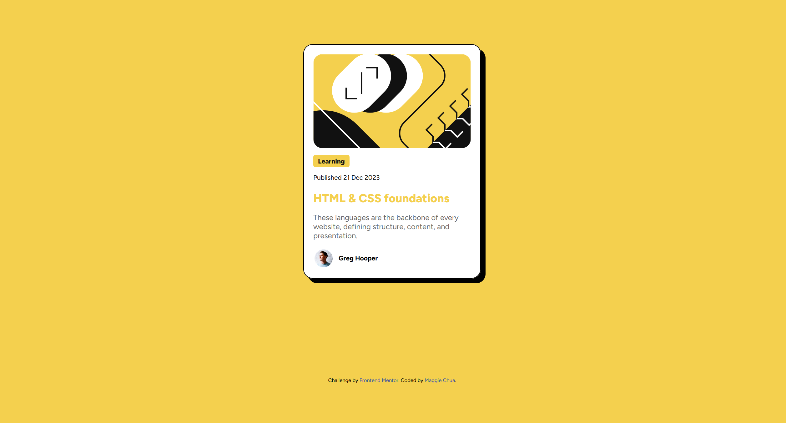

# Frontend Mentor - Blog preview card solution

This is a solution to the [Blog preview card challenge on Frontend Mentor](https://www.frontendmentor.io/challenges/blog-preview-card-ckPaj01IcS). Frontend Mentor challenges help you improve your coding skills by building realistic projects. 

## Table of contents

- [Overview](#overview)
  - [The challenge](#the-challenge)
  - [Screenshot](#screenshot)
  - [Links](#links)
- [My process](#my-process)
  - [Built with](#built-with)
  - [What I learned](#what-i-learned)
  - [Continued development](#continued-development)
- [Author](#author)

## Overview

### The challenge

Users should be able to:

- See hover and focus states for all interactive elements on the page

### Screenshot




### Links

- Solution URL: [Add solution URL here](https://your-solution-url.com)
- Live Site URL: [Add live site URL here](https://your-live-site-url.com)

## My process

### Built with

- Semantic HTML5 markup
- CSS custom properties
- Flexbox
- CSS Grid

### What I learned

I didn't realize that there were learning paths that you could follow on the platform that provided projects that they recommended you do in a certain order, so I completed the recipe page project before this. As a result, I think that I found this project a lot easier to complete without having to reference too much documentation and it was easier to troubleshoot through issues. 

I think I found the formatting for the html a little bit more difficult this time around, I wasn't able to figure out right at the gate which items to put into their own separate divs for easier CSS styling. It was after experimenting with the styling where I realized what types of formatting I needed for individual elements that resulted in some changes to the overall layout of the html. 

For the CSS, I learned how to use the box-shadow property and how to modify the border thickness using border-width. It's such a cool feature and it was fun playing around with it and figuring out how much offset I wanted it to have. There is a variation of box-shadow where if you included four elements total (x-offset, y-offset, blur-radius, color), you would have a blurred shadow instead. 

```css
.container {
    background-color: hsl(0, 0%, 100%);
    display: flex;
    flex-direction: column;
    padding: 20px;
    margin: auto 40%;
    border: solid;
    border-width: 1.5px;
    box-shadow: 10px 10px black;
}
```
After receiving feedback from @skyv26 on Frontend Mentor for the QR Code Project, I learned how to format content in the body, so that it would be centered. It seems like it's impossible to achieve that with flex display because it only is able to align items in 1D, so either horizontal and vertical, which is why one must use grid (I think). Also, by setting the height to just the size of the screen (100vh; does not take away from the search bar in the browser), it doesn't lead to additional excess space when you add margin properties, requiring you to scroll. 

```css
body {
    font-family: Figtree;
    background-color: hsl(47, 88%, 63%);
    display: grid;
    place-items: center;
    height: 100vh;
}
```

There are also active states, which refer to changes in behavior when a user interacts with an element. For this one, we simply had to make the color of the title change color when a user hovered over it. I also learned that the cursor doesn't automatically turn into a mini hand when you do which is why you have to set the cursor to point when the item in question is being hovered on. 

```css
h1:hover {
    color:hsl(47, 88%, 63%);
    cursor: pointer;
}
```

I also got practice with CSS selectors by using combinatorics[?], where you can access more specific elements inside divs, or other higher-level elements. I think I'm gaining a stronger understanding of where to style things and how to reduce code duplication by creating higher-level combined calls to specific elements vs. using combinatorics to really focus on a specific feature. 

```css
.learning > p:first-of-type {
    background-color: hsl(47, 88%, 63%);
    font-weight: 800;
    padding: 5px 10px;
    border-radius: 5px;
}
```
Finally, the creator area where it included the portrait photo and the guy's name did take a bit of troubleshooting to figure out. I realized that I could use flex (since it's in one direction) and I could center the items just using align-items. However, when going through the documentation of different formatting options, I realized that I was still pretty iffy on things like inline-block, etc. and how they were different from flex or grid. Also, when would it make sense to use them. 

```css
.creator {
    display: flex;
    align-items: center;
    font-size: 14px;
    margin: -10px;
}
```

### Continued development

I think this project made me realize how much I truly learned throughout the process of working on this project. However, it brought to my attention that I still struggle a lot with figuring out accessibility, especially for structuring my HTML as well as needing to get more practice of display options such as inline-block as well as cases where implementation of this feature makes sense. I also would like to get more practice working with active states and media queries. 

## Author

- Website - [Maggie Chua](https://github.com/maggiechua/maggiechua-fdMentorProjects)
- Frontend Mentor - [@maggiechua](https://www.frontendmentor.io/profile/yourusername)