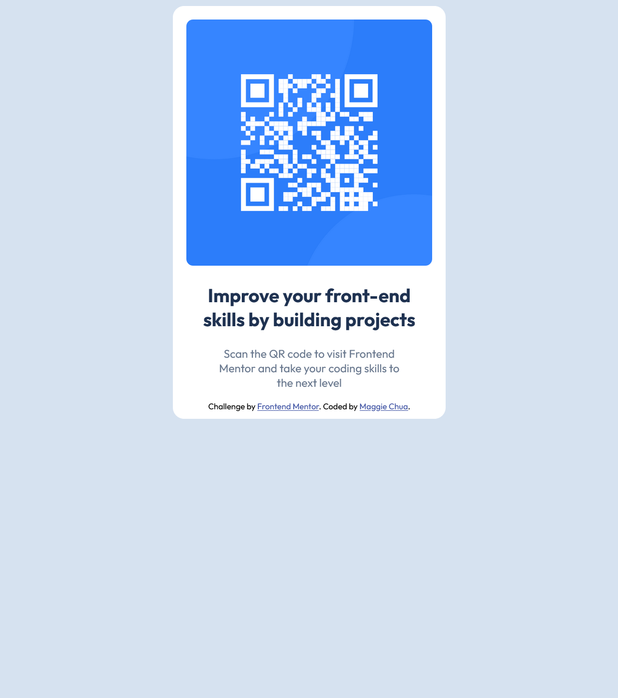

# Frontend Mentor - QR code component solution

This is a solution to the [QR code component challenge on Frontend Mentor](https://www.frontendmentor.io/challenges/qr-code-component-iux_sIO_H). Frontend Mentor challenges help you improve your coding skills by building realistic projects. 

## Table of contents

- [Overview](#overview)
  - [Screenshot](#screenshot)
  - [Links](#links)
- [My process](#my-process)
  - [Built with](#built-with)
  - [What I learned](#what-i-learned)
  - [Continued development](#continued-development)
  - [Useful resources](#useful-resources)
- [Author](#author)

**Note: Delete this note and update the table of contents based on what sections you keep.**

## Overview

### Screenshot



### Links

- Solution URL: [Add solution URL here](https://your-solution-url.com)

## My process

### Built with

- Semantic HTML5 markup
- CSS custom properties
- Flexbox

**Note: These are just examples. Delete this note and replace the list above with your own choices**

### What I learned

While I have done some HTML/CSS in the past, I wouldn't say I felt particularly confident about my skills or understanding of frontend concepts. I think my previous foray was quite shallow as I knew how to apply the context, but I was missing the bigger picture on how to format elements, especially as the amount of items you need to include grow. 

```html
<h1>Some HTML code I'm proud of:</h1>
<div class="container">
    
    <h3 class="text">Improve your front-end skills by building projects</h3>
    <p class="text">Scan the QR code to visit Frontend Mentor and take your coding skills to the next level</p>
    <div class="attribution">
      Challenge by <a href="https://www.frontendmentor.io?ref=challenge" target="_blank">Frontend Mentor</a>. 
      Coded by <a href="https://github.com/maggiechua" target="_blank">Maggie Chua</a>.
    </div>
  </div>
```
For instance, I didn't know about <div> and how you could use it to separate/group elements, which if done well, makes it a lot easier to style them later down the line. (I know it's basically all my index.html code, but it felt necessary to paste it to get my point across haha).

As a result, I think the way I structured my HTML made it easier to select items to style individually or collectively. While I still have a long way to go with understanding layouts, I have somewhat of an understanding on how to use flexbox as well as how to organize elements within it. As such, I feel especially proud of the .container code I did. I do admit that there's probably a way to simplify this, but I think it's quite good for my first try. 

```css
.container {
    display: flex;
    flex-direction: column;
    flex-wrap: wrap;
    align-self: center;
    align-content: flex-start;
    align-items: center;
    box-sizing: border-box;
    height: 20%;
    width: 45%;
    margin: 0 auto;
    border-radius: 15px;
    background-color: white;
}
```
Overall, I think the biggest thing I took away was that frontend is more interesting and fun than I had originally thought. Since I don't have a lot of experience working on such projects, it was a pretty fun first project and I think I learned a fair bit. 

### Continued development

I think that for future projects, I still need to work on understanding layout properties, especially when to use flexbox vs grid as well as implementing the many functionalities that are offered by CSS. 

One thing I wasn't able to figure out was how to center the entire object in the center of the screen, both horizontally and vertically. So for the future, I definitely want to build my understanding on formatting objects on different levels within an HTML DOM, especially when nested within layouts. I also want to improve my understanding of positioning and when it would make sense to use absolute vs relative vs sticky, etc. 

I plan to keep going through web.dev's HTML/CSS articles as well as working on other frontendmentor projects along the way. 

### Useful resources

- [Example resource 1](https://www.example.com) - This helped me for XYZ reason. I really liked this pattern and will use it going forward.
- [Example resource 2](https://www.example.com) - This is an amazing article which helped me finally understand XYZ. I'd recommend it to anyone still learning this concept.

**Note: Delete this note and replace the list above with resources that helped you during the challenge. These could come in handy for anyone viewing your solution or for yourself when you look back on this project in the future.**

## Author

- Website - [Add your name here](https://www.your-site.com)
- Frontend Mentor - [@yourusername](https://www.frontendmentor.io/profile/yourusername)

**Note: Delete this note and add/remove/edit lines above based on what links you'd like to share.**
