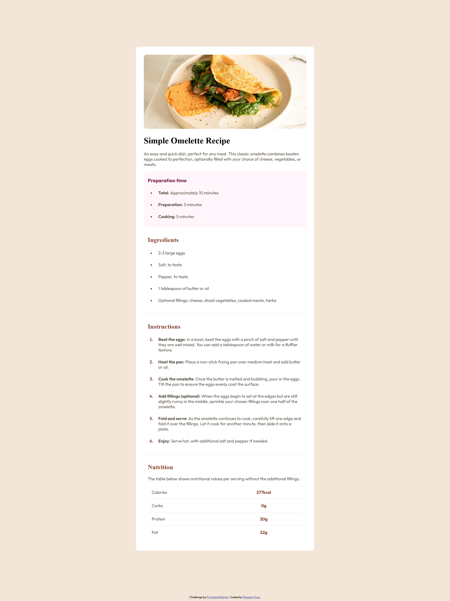

# Frontend Mentor - Recipe page solution

This is a solution to the [Recipe page challenge on Frontend Mentor](https://www.frontendmentor.io/challenges/recipe-page-KiTsR8QQKm). Frontend Mentor challenges help you improve your coding skills by building realistic projects. 

## Table of contents

- [Overview](#overview)
  - [Screenshot](#screenshot)
  - [Links](#links)
- [My process](#my-process)
  - [Built with](#built-with)
  - [What I learned](#what-i-learned)
  - [Continued development](#continued-development)
  - [Useful resources](#useful-resources)
- [Author](#author)

## Overview

### Screenshot



### Links

- Solution URL: [Solution](https://www.frontendmentor.io/solutions/recipe-webpage-built-using-html-css-mDVzrrwy_H)
- Live Site URL: [Live Site](https://maggiechua.github.io/maggiechua-fdMentorProjects/)

## My process

### Built with

- Semantic HTML5 markup
- CSS custom properties
- Flexbox

### What I learned

Use this section to recap over some of your major learnings while working through this project. Writing these out and providing code samples of areas you want to highlight is a great way to reinforce your own knowledge.

Going into this project, I knew that I had to consider how I was formatting everything, since there were a lot more elements involved in the overall webpage. Using my basic knowledge, I'm proud of how I formatted my code as I think it's quite readable with clear classes, that allowed CSS styling easier. A new component that I learned was how to build and style tables. There is a table head <thead> and table body <tbody> element, but since there were no specific headings, I omitted them. Additionally, you would initialize data in the table using table row <tr> and each one can have a table data <td> and table heading <th>. Since <th> is normally bolded, I switched the information nested in it, so I wouldn't have to go in and change the font-weight in CSS. But perhaps, since CSS is about styling after all, I should've just went with normal conventions regardless. 

Regardless, I'm especially proud of the table that I used under the nutrition section, which is listed below in the following snippet: 
```html
<h1>Some HTML code I'm proud of</h1>
<table>
                <tbody>
                  <tr>
                    <td>Calories</td>
                    <th>277kcal</th>
                  </tr>
                  <tr>
                    <td>Carbs</td>
                    <th>0g</th>
                  </tr>
                  <tr>
                    <td>Protein</td>
                    <th>20g</th>
                  </tr>
                  <tr>
                    <td>Fat</td>
                    <th>22g</th>
                  </tr>
                </tbody>
</table>
```
Since I later realized that it made sense to use two tables (one for separating the sections of the page and another for the Nutrition section), I had to use special selectors to access specific elements and differentiate them. I tried my best to avoid any code duplication and to keep the amount of selectors I used to a minimum, while also maintaining the challenge design. A major thing I learned was that to display the lines, you can use the border property and using -style, -color, -width, you could customize its appearance accordingly. Additionally, to avoid the double borders, it was important to use border-collapse: collapse to ensure single-line borders around the cells. It was also helpful to learn that adjusting cell size and spacing is similar to normal element components as you could use padding and margin properties to accomplish that. 

```css
table {
    table-layout: fixed;
    width: 100%;
    border-collapse: collapse;
}

tr {
    border-bottom-style: solid;
    border-bottom-color: hsl(30, 18%, 87%);
    border-bottom-width: thin;
    padding: 30px;
}

.nutrition > tr {
    text-align: center;
}

tr:last-of-type {
    border-bottom: none;
}

td, th {
    padding: 15px;
}
```
I also learned a little bit about media queries. I can't say I know a lot about them, but I wanted to use them for adjusting the contents when the user changes the window size. We were half successful in this endeavor as the container takes up the entire page when minimized, but it still has margins that exist at the top and bottom, that kind of ruin the overall design. For this specific case, I was using the screen query where I set the max-width to the desktop size provided in the style-guide.md, where the container would be adjusted so that it takes up the entire screen in the case where it is minimized. I still don't fully understand how to use this properly, as I'm confused why the background-color in the body section didn't change. Maybe it's defaulting to the other style code? But why? 

I wasn't quite sure how to override it, so I've left it as is:

```css
@media screen and (max-width: 1440px) {
    body {
        background-color: hsl(0, 0%, 100%);
    }
    .container {
        margin: 0;
        padding: 0;
        height: 93%;
        width: 93%;
    }
}
```

### Continued development

I think for future projects, I want to work on understanding how to create more responsive designs, especially in the case of various window sizes, ensuring that the integrity of a design is kept intact. I also want to build a stronger understanding of how to manipulate media queries as well as pick up more practice on CSS selectors. 

### Useful resources

- [Stack Overflow | CSS: Control space between bullet and <li>](https://stackoverflow.com/questions/4373046/css-control-space-between-bullet-and-li) - I was stuck on how to modify the markers as I had tried ::marker and it still didn't quite look right. I found the suggestions on this post incredibly useful for reference. 
- [How to add spaces between Table rows in HTML?](https://www.keentodesign.com.au/how-to-add-spaces-between-table-rows-in-html/) - This was a great article that talks about ways to format your table, especially if you get stuck. 

## Author

- Website - [Maggie Chua](https://maggiechua.github.io/maggiechua-fdMentorProjects/)
- Frontend Mentor - [@maggiechua](https://www.frontendmentor.io/profile/maggiechua)
